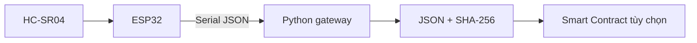

# Đề tài 2 - HRC Safety Log dùng ESP32 và cảm biến siêu âm

## 1. Mục tiêu

Xây dựng một nút IoT nhỏ dùng ESP32 và HC-SR04 để đo khoảng cách. Khi khoảng cách nhỏ hơn ngưỡng cấu hình, ESP32 xuất trạng thái `WARNING` qua Serial; khi cảm biến không trả về echo, xuất `SENSOR_FAULT`. Gateway tùy chọn ghi cảnh báo thành JSON, tính SHA-256 và lưu hash lên Smart Contract để audit.

Phiên bản này không dùng camera, YOLO, mô hình AI, relay, buzzer hoặc E-Stop.

## 2. Luồng dữ liệu



ESP32 chỉ đo và xuất dữ liệu; gateway không được xem là điều kiện để cảm biến hoạt động.

## 3. Kịch bản demo

- `distance >= 50 cm`: `SAFE`, không tạo cảnh báo.
- `distance < 50 cm`: `WARNING`, gateway ghi một cảnh báo sau cooldown.
- `pulseIn` timeout: `SENSOR_FAULT`, gateway ghi lỗi cảm biến.
- Chu kỳ đo mặc định: 200 ms.

## 4. Phần cứng và nối dây

| Thiết bị/chân | Kết nối |
|---|---|
| ESP32 DevKit V1 | MCU và Serial 115200 baud |
| HC-SR04 VCC/GND | Nguồn 5 V và GND chung |
| HC-SR04 TRIG | ESP32 GPIO25 |
| HC-SR04 ECHO | Qua cầu phân áp 1 kΩ/2 kΩ rồi vào GPIO26 |
| Breadboard/dây | Kết nối thử nghiệm |

**Bắt buộc:** ECHO của HC-SR04 có thể ở mức 5 V; không đưa trực tiếp vào GPIO ESP32. Dùng cầu phân áp và kiểm tra bằng đồng hồ trước khi cấp nguồn.

## 5. Firmware

File: `iot_code/firmware/hrc_safety_ultrasonic.ino`.

Firmware dùng `pulseIn` với timeout 30 ms, tính khoảng cách từ thời gian echo và xuất dòng JSON:

```json
{"device_id":"ESP32-HRC-01","sensor_id":"HC-SR04","timestamp_ms":1727000000000,"distance_cm":42.7,"state":"WARNING","seq":1842}
```

## 6. Gateway và hash

Chạy gateway bằng cổng Serial:

```powershell
python -m iot_code.gateway --port COM3
```

Hoặc dùng dữ liệu mẫu:

```powershell
Get-Content .\docs\sample_telemetry.json | python -m iot_code.gateway --stdin --cooldown-seconds 0
```

Gateway bỏ qua dòng khởi động và mẫu `SAFE`, tạo `WARN-...json` cho `WARNING`/`SENSOR_FAULT`, canonical hóa JSON và lưu SHA-256 ở trường `log_sha256`.

## 7. Blockchain tùy chọn

Contract `contracts/contracts/SafetyLog.sol` nhận:

- `warningId`
- `logHash`
- `deviceId`
- `sensorId`
- `severity`

Blockchain chỉ là audit trail; nó không điều khiển cảm biến và không nằm trong đường đo khoảng cách.

## 8. Kiểm thử

```powershell
python -m unittest discover -s tests -v
python -m compileall -q iot_code
cd contracts
npx hardhat test
```

Kiểm tra tối thiểu: đo ở hai phía ngưỡng 50 cm, kiểm tra timeout cảm biến, sửa một trường JSON để xác minh hash chuyển sang `INVALID`, và thử duplicate `warningId` trên contract.

## 9. An toàn và giới hạn

Đây là prototype giáo dục. HC-SR04 phụ thuộc góc, vật liệu và môi trường; không dùng kết quả này làm hệ thống bảo vệ người/robot công nghiệp nếu chưa có thiết kế và chứng nhận an toàn độc lập.