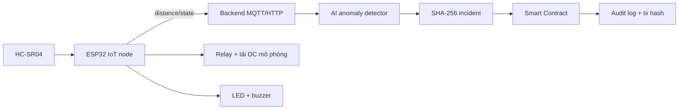
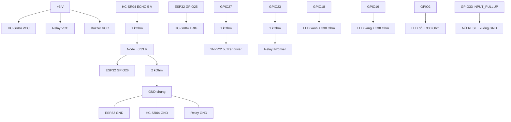

# Đề tài 2 - HRC Safety Log dùng ESP32 và cảm biến siêu âm

## 1. Tên đề tài và mục tiêu

**Hộp đen an toàn cho robot hợp tác dùng ESP32, cảm biến siêu âm và Blockchain**.

Đồ án mô phỏng vùng làm việc chung giữa người và robot: ESP32 đo khoảng cách; khi người/vật thể vào vùng nguy hiểm, thiết bị tự cảnh báo và ngắt tải DC mô phỏng qua relay; backend phát hiện bất thường, tạo log; SHA-256 của log được ghi lên Smart Contract.

> An toàn: relay chỉ đóng/cắt đèn hoặc motor DC điện áp thấp. Không nối prototype vào robot công nghiệp hoặc E-Stop đạt chuẩn. E-Stop thật phải là mạch phần cứng độc lập, fail-safe. Blockchain không nằm trong vòng phản hồi dừng khẩn cấp thời gian thực.

## 2. Kịch bản demo và kiến trúc CPS

- `d >= 100 cm`: SAFE - LED xanh, relay ON.
- `50 <= d < 100 cm`: WARNING - LED vàng, buzzer ngắt quãng.
- `d < 50 cm` trong 3 mẫu liên tiếp: DANGER - LED đỏ, buzzer liên tục, relay OFF, tạo incident.
- Cảm biến timeout: SENSOR_FAULT - relay OFF theo nguyên tắc fail-safe của mô hình.



ESP32 tự ngắt relay ngay khi DANGER; backend/blockchain chỉ ghi nhận và đồng bộ, không phải điều kiện để dừng tải.

## 3. Phần cứng cần mua

| Linh kiện | SL | Vai trò/ghi chú |
|---|---:|---|
| ESP32 DevKit V1 (WROOM-32) | 1 | MCU, Wi-Fi |
| HC-SR04 | 1 | Đo 2-400 cm; ECHO là 5 V |
| R 1 kOhm + R 2 kOhm | 1 bộ | Chia áp ECHO xuống khoảng 3.33 V |
| Relay 1 kênh 5 V có transistor/diode | 1 | Ngắt tải DC thấp áp |
| Buzzer active 5 V | 1 | Cảnh báo; nên qua 2N2222 |
| 2N2222/BC547, R 1 kOhm, diode 1N4007 | 1 bộ | Driver buzzer/relay nếu module chưa tích hợp |
| LED xanh/vàng/đỏ + R 220-330 Ohm | 3 bộ | SAFE/WARNING/DANGER |
| Nút nhấn RESET/ACK | 1 | Dùng INPUT_PULLUP |
| Nguồn 5 V >= 1 A, breadboard, dây Dupont | 1 bộ | Nguồn relay/HC-SR04/buzzer |
| Tải DC nhỏ (đèn 5 V hoặc motor nhỏ) | 1 | Tải mô phỏng, không dùng điện lưới |
| OLED I2C 0.96 inch (tùy chọn) | 1 | Hiển thị trạng thái |
| RFID RC522 (tùy chọn) | 1 | Định danh người vận hành; chỉ mức 3.3 V |

Phần mềm: Arduino IDE/PlatformIO; `WiFi.h`, `HTTPClient.h` hoặc `PubSubClient`; backend FastAPI/Flask + SQLite/JSON; AI baseline median + debounce + z-score (nâng cấp Isolation Forest); Hardhat + Solidity + Ethers.js.

## 4. Sơ đồ nguyên lý



**Bắt buộc:** không đưa ECHO 5 V trực tiếp vào ESP32; dùng cầu phân áp 1 kOhm/2 kOhm. GND nguồn và ESP32 nối chung. Không cấp motor/relay công suất từ chân 3V3. Relay module không có transistor/diode phải dùng driver NPN + diode.

## 5. Sơ đồ nối dây

| Thiết bị/chân | ESP32 hoặc nguồn |
|---|---|
| HC-SR04 VCC/GND | 5 V/GND chung |
| HC-SR04 TRIG | GPIO25 |
| HC-SR04 ECHO | ECHO -> R1 1 kOhm -> node -> GPIO26; node -> R2 2 kOhm -> GND |
| Relay VCC/GND/IN | 5 V/GND/GPIO23 (qua driver nếu cần) |
| Tải DC | Nguồn tải (+) -> COM relay; NO relay -> tải (+); tải (-) -> GND nguồn |
| Buzzer | +5 V; cực âm vào collector 2N2222; emitter GND; base qua 1 kOhm từ GPIO27 |
| LED xanh/vàng/đỏ | GPIO18/19/2 -> R 330 Ohm -> anode; cathode GND |
| Nút RESET | GPIO33 và GND |
| OLED tùy chọn | VCC 3.3 V, GND, SDA GPIO21, SCL GPIO22 |

```text
5V ---> HC-SR04 VCC, Relay VCC, Buzzer VCC
GND --> ESP32/HC-SR04/Relay/driver (chung mass)
GPIO25 ---------------- TRIG
ECHO --1k--+----------- GPIO26
           +--2k------ GND
GPIO23 ---------------- Relay IN -> COM/NO -> tải DC thấp áp
GPIO27 --1k--> 2N2222 -> Buzzer
GPIO18/19/2 --330R--> LED xanh/vàng/đỏ -> GND
GPIO33 ---------------- Nút RESET -> GND
```

## 6. Dữ liệu, AI và Blockchain

Chu kỳ đo 100-200 ms; median 5 mẫu; timeout 30 ms; chống lặp incident 5 s.

```json
{"device_id":"ESP32-HRC-01","robot_id":"ROBOT-DEMO-01","timestamp_ms":1727000000000,"distance_cm":42.7,"state":"DANGER","relay":"OFF","seq":1842}
```

AI baseline: vượt ngưỡng + 3-sample debounce, moving average/z-score; nếu đủ dữ liệu thì dùng Isolation Forest và báo precision/recall. Incident JSON được canonical hóa (UTF-8, sort key, bỏ trường hash), băm SHA-256. Contract lưu `incidentId`, `logHash`, `deviceId`, `robotId`, mức độ, action và event `IncidentRecorded`; JSON đầy đủ giữ off-chain.

## 7. Kế hoạch 2 tuần

### Tuần 1 - Phần cứng và IoT

| Ngày | Việc cần làm | Kết quả |
|---:|---|---|
| 1 | Chốt ngưỡng, kịch bản, pin map, BOM | README + sơ đồ |
| 2 | ESP32 + HC-SR04 + cầu phân áp | Đo ổn định, ECHO <= 3.3 V |
| 3 | LED, buzzer, RESET | Ba trạng thái hoạt động |
| 4 | Relay + tải DC thấp áp | DANGER -> relay OFF |
| 5 | Median, debounce, timeout, fail-safe | Chạy 30 phút không treo |
| 6 | Wi-Fi + HTTP/MQTT + backend | Lưu >= 1000 mẫu |
| 7 | Tích hợp và kiểm thử | Video/ảnh mốc tuần 1 |

### Tuần 2 - AI, Blockchain, UI và báo cáo

| Ngày | Việc cần làm | Kết quả |
|---:|---|---|
| 8 | Thu dữ liệu SAFE/WARNING/DANGER | CSV/JSON có nhãn |
| 9 | Baseline AI, tùy chọn Isolation Forest | Chỉ số hoặc confusion matrix |
| 10 | Viết/test/deploy Solidity trên Hardhat | `recordIncident`, event |
| 11 | Backend -> canonical JSON -> SHA-256 -> contract | Incident có tx hash |
| 12 | Dashboard thời gian thực | Khoảng cách, state, log, tx |
| 13 | Rehearsal, mất Wi-Fi, cảm biến lỗi | Local stop vẫn hoạt động |
| 14 | Báo cáo 10-15 trang, slide, demo | Repo chạy theo README |

Ưu tiên nếu thiếu thời gian: (1) ESP32 + HC-SR04 + cảnh báo/relay + backend + hash + contract local; (2) dashboard; (3) Isolation Forest, RFID, OLED, testnet.

## 8. Kiểm thử và phân công

Đo sai số tại 20/50/100/150 cm; thử vật thể góc nghiêng/màu tối; rút Wi-Fi để xác nhận relay vẫn OFF; rút cảm biến để xác nhận SENSOR_FAULT; sửa một trường JSON để kiểm tra hash thất bại; test quyền gọi và incident trùng ID trên contract.

- **IoT/Embedded:** mạch, firmware, lọc và kiểm thử cảm biến.
- **AI/Backend:** API, lưu dữ liệu, detector, canonical hash.
- **Blockchain:** Solidity, test, deploy, Ethers.js gateway.
- **UI/Report:** dashboard, sơ đồ, số liệu, slide/video.

## 9. Cấu trúc repository

```text
HRC-Safety-Log/
├─ iot_code/       # firmware ESP32
├─ ai_model/       # detector + dữ liệu
├─ backend/        # API, hashing, gateway
├─ contracts/      # Solidity/test/deploy
├─ dashboard/      # giao diện
├─ docs/de_tai_2_esp32_sieu_am.md
└─ Report_NhomXX.pdf
```
